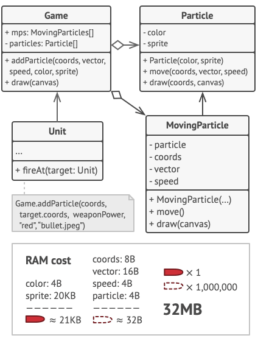

# Intent:
Use sharing to support large numbers of fine-grained objects efficiently.

# Example Problem:
You create a game with lots od particles like bullets, shrapnel and missile for example. Each 
particle is represented in its own object with lots of data. The computer will run out of RAM.

# Solution:
The particle class contains fields like sprite, which have a big size. All bullets, for example, 
have the same sprite and the same color. Other fields like vector are unique to each particle.

Constant data is called the objects intrinsic state and the changing data is called an objects
extrinsic state.
The Flyweight pattern suggests that extrinsic state should not be stored in the object. Pass the 
extrinsic state to functions who care. Only the intrinsic state stays with the object, letting you 
resuse it in different contexts. You now only need one object for each different intrinsic state.

# Components:

# Pros & Cons
## Pros:

## Cons:

# Applicability(When to use):

# How to implement:
* In most cases, the client does not create the flywieght itself.
* It is requested from a pool.
* Typically a factory that may use associative container to store the flywieghts.
* A client requests a fly weight through its key.
* Th epool will either create it with intrinsic state or supply an existing one.
* THe extrinsic state should be computed separately.
* The interface of the flyweight does not enforce sharing. Some objects may be unshare.
* THe pool can instantiate all flyweights and keep them around permanently if their count is low.
* The flywieghts ar immutable, and their behavior depends on the extrinsic state.

 
# Relations with other patterns

# Pseudocode Example
