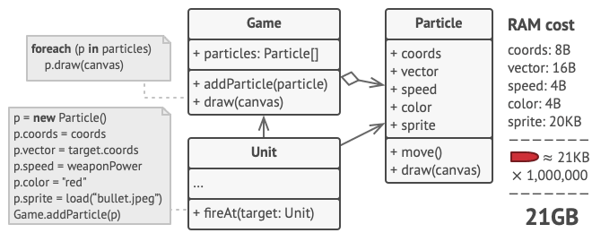
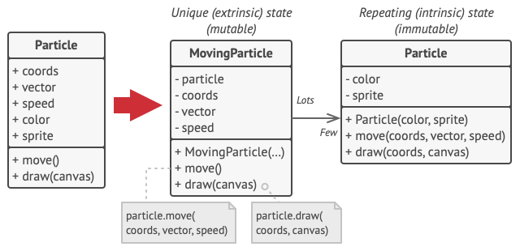
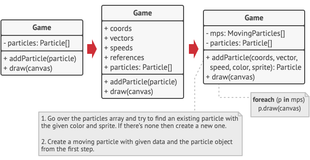

# Intent:
Use sharing to support large numbers of fine-grained objects efficiently.

# Example Problem:
You create a game with lots od particles like bullets, shrapnel and missile for example. Each 
particle is represented in its own object with lots of data. The computer will run out of RAM.

# Solution:
The particle class contains fields like sprite, which have a big size. All bullets, for example, 
have the same sprite and the same color. Other fields like vector are unique to each particle.

Constant data is called the objects intrinsic state and the changing data is called an objects
extrinsic state.
The Flyweight pattern suggests that extrinsic state should not be stored in the object. Pass the 
extrinsic state to functions who care. Only the intrinsic state stays with the object, letting you 
resuse it in different contexts. You now only need one object for each different intrinsic state.

**Extrinsic state storage**
In most cases the extrinsic state is moved to container object. In the example above it's the *Game* 
object thath stores all particles in the *particles* field. To move the extrinsic state into this 
class, you need to create several array fields for storing coodinates, vectors, and speed of each 
individual particle. But that's not all. YOu need another array for storing references to a specific
flyweight that represents a particle. These arrays must be in sync so tat you can access all data
of a particle using the same index.

A more elegant solution is to create a seperate context class that would store the extrinsic state 
along with reference to the flyweight object. This approach would require having just asingle array 
in the container class. There is still an object needed for every particle, but the they are smaller
without the large fields.

**Flyweight and immutability**
Since the same flyweight object can be used in diffrent contexts, you have to make sure that its 
state can't be modified. A flyweight should initialize its stae just once via a constructor 
parameters. It shouldn't expose any setters or public fields to other objects.

**Flyweight factory**
For more convinient acces to various flyweights, you can create afactory method that manages a pool 
of existing flyweight objects. The method accepts the intrinsic state of the desired flyweight from 
a client, looks for an existing flyweight object matching this state, and returns it if it was 
found. If not, it creates a new flywieght and adds it to the pool.
There are several options where this method could be placed. The most obvious place is a flyweight 
container. ALternatively, you could create a new factory class. Or you could make the factory method 
static and put it inside an actual flyweight class.

# Components:

* The flyweight pattern is merely an optimization. Before applying it, make sure your program does 
have the RAM consumption problem related to ahving a massive number of similar objects in memoty at 
the same time. Make sure that this problem can't be solved in any other meaningful way.
* **Flyweight**: contains the protion of the original object's state that can be shared between 
multiple objects. The same flyweight object can be used in many different contexts. The state stored 
inside a flywiehgt is called *intrinsic*. The state passed to the flyweight's methods is called
*extrinsic*.

# Pros & Cons
## Pros:

## Cons:

# Applicability(When to use):

# How to implement:
* In most cases, the client does not create the flywieght itself.
* It is requested from a pool.
* Typically a factory that may use associative container to store the flywieghts.
* A client requests a fly weight through its key.
* Th epool will either create it with intrinsic state or supply an existing one.
* THe extrinsic state should be computed separately.
* The interface of the flyweight does not enforce sharing. Some objects may be unshare.
* THe pool can instantiate all flyweights and keep them around permanently if their count is low.
* The flywieghts ar immutable, and their behavior depends on the extrinsic state.

 
# Relations with other patterns

# Pseudocode Example
