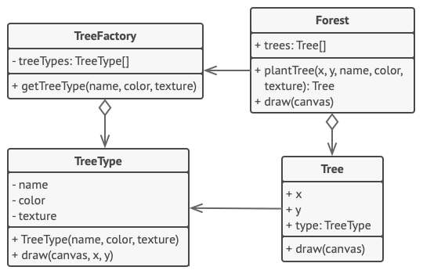

# Intent:
Use sharing to support large numbers of fine-grained objects efficiently.

# Example Problem:
You create a game with lots od particles like bullets, shrapnel and missile for example. Each 
particle is represented in its own object with lots of data. The computer will run out of RAM.

# Solution:
The particle class contains fields like sprite, which have a big size. All bullets, for example, 
have the same sprite and the same color. Other fields like vector are unique to each particle.

Constant data is called the objects intrinsic state and the changing data is called an objects
extrinsic state.
The Flyweight pattern suggests that extrinsic state should not be stored in the object. Pass the 
extrinsic state to functions who care. Only the intrinsic state stays with the object, letting you 
resuse it in different contexts. You now only need one object for each different intrinsic state.

**Extrinsic state storage**
In most cases the extrinsic state is moved to container object. In the example above it's the *Game* 
object thath stores all particles in the *particles* field. To move the extrinsic state into this 
class, you need to create several array fields for storing coodinates, vectors, and speed of each 
individual particle. But that's not all. YOu need another array for storing references to a specific
flyweight that represents a particle. These arrays must be in sync so tat you can access all data
of a particle using the same index.

A more elegant solution is to create a seperate context class that would store the extrinsic state 
along with reference to the flyweight object. This approach would require having just asingle array 
in the container class. There is still an object needed for every particle, but the they are smaller
without the large fields.

**Flyweight and immutability**
Since the same flyweight object can be used in diffrent contexts, you have to make sure that its 
state can't be modified. A flyweight should initialize its stae just once via a constructor 
parameters. It shouldn't expose any setters or public fields to other objects.

**Flyweight factory**
For more convinient acces to various flyweights, you can create afactory method that manages a pool 
of existing flyweight objects. The method accepts the intrinsic state of the desired flyweight from 
a client, looks for an existing flyweight object matching this state, and returns it if it was 
found. If not, it creates a new flywieght and adds it to the pool.
There are several options where this method could be placed. The most obvious place is a flyweight 
container. ALternatively, you could create a new factory class. Or you could make the factory method 
static and put it inside an actual flyweight class.

# Components:

* The flyweight pattern is merely an optimization. Before applying it, make sure your program does 
have the RAM consumption problem related to ahving a massive number of similar objects in memoty at 
the same time. Make sure that this problem can't be solved in any other meaningful way.
* **Flyweight**: contains the protion of the original object's state that can be shared between 
multiple objects. The same flyweight object can be used in many different contexts. The state stored 
inside a flywiehgt is called *intrinsic*. The state passed to the flyweight's methods is called
*extrinsic*.
* **Context**: contains the extrinsic state, unique across all original objects. When a context is 
paired with one of the flyweight objects, it represents the full state of the original object.
* Usually, the behavior of the original object remains in the flyweight class. In this case, whoever 
calls a flyweight's method must also pass appropriate bits of the extrinsic state into the 
method's parameters. On the other hand, the behavior can be moved to the context class, which would 
use the context class, which would use the linked flyweight merely as a data object.
* **Client** clalculates or stores the extrinsic state of flyweights. From the client's perspective, 
a flyweight is a template object which can be configured at runtime by passong some contextual data
into parameters of its methods.
* **Flyweight Factory**: manages a pool of existing flyweights. With the factory, clients don't 
create flyweights directly. Instead the call the factory, passong it bits of the intrinsic state of
the desired flyweight. The factory looks over previously created flyweights and either returns an 
existing one that matches search criteria or creates a new one if nothing is found.

# Pros & Cons
## Pros:
* You can save a lot of RAM, assuming the program has tons of similar objects.

## Cons:
* You might be trading RAM over CPU cycles when some of the context data needs to be recalculated 
each time somebody calls a flyweight method.
* The code becomes much more complicated. New team members will always be wondering why the state of
an entity was separated in such a way.

# Applicability(When to use):
* Use the Flyweight pattern only when your program must support a huge number of objexts which 
barely fit into available RAM. 
The benefit of applying the pattern depends heavily on how and where it's used. It's most useful 
when:
- an application needs to spawn a huge number of similar objects.
- this drains all available RAM on target device
- the objects contain duplicate states which can be extracted and shared betwen multiple objects.

# How to implement:
* In most cases, the client does not create the flywieght itself.
* It is requested from a pool.
* Typically a factory that may use associative container to store the flywieghts.
* A client requests a fly weight through its key.
* The pool will either create it with intrinsic state or supply an existing one.
* The extrinsic state should be computed separately.
* The interface of the flyweight does not enforce sharing. Some objects may be unshare.
* The pool can instantiate all flyweights and keep them around permanently if their count is low.
* The flywieghts ar immutable, and their behavior depends on the extrinsic state.

1. Divide fields of class that will become flywights into two parts:
- The intrinsic state: fields that contain unchanging fata duplicated across many objects.
- the extrinsic state: the fields that contain contextual data unique to each object.
2. Leave the fields that represent the intrinsic state in the class, but make sure they're 
immutable. They should take their initial values only inside the constructor.
3. Go over methods that use fields of the extrinsic state. For each field used in the method,
introduce a new parameter and use it instead of the field.
4. Optionally, create a factory class to manage the pool of flyweights. It should check for an 
existing flyweight before creating a new one. Once the factory is in place, clients must only 
request flyweights through it. They should describe the desired flyweight by passing its 
intrinsic state to the factory.
5. The client must store or calculate values of the extrinsic state (context) to be able to call 
methods of flyweight objects. For the sake of convinience, the extrinsic state along with the 
flyweight object. For the sake of convinience, the extrinsic state along with the flyweight-
referencing field may be moved to a separate context class.

 
# Relations with other patterns

# Pseudocode Example
In this example, the **Flyweight** pattern helps to redurce memory usage when rendering millions of 
tree  objects on a canvas.

The repeating intrinsic state is extracted from the main *Tree* class is moved into the flyweigt 
class *Treetype*
Instead of storing the data in multiple objects, it is kept in just a few flyweight objects nad 
linked to appropriate *Tree* objects which act as contexts. The client code creates new tree objects 
using the flyweught factory, which encapsulates the complexity of searching for the right object and
reusing it if needed.

    // The flyweight class contains a portion of the state of a tree. These fields store values that
    // are unique for each particular tree. For instance, you won't find here the tree coordinates.
    // But the texture and colors shared between many trees are here. Since this data is usually 
    // BIG, you'd waste a lot of memory by keeping it in each tree object. Instead, we can extract
    // texture, color and other repeating data into a separate object which lots of individual tree
    // objects can reference.
    class TreeType is
        field name
        field color
        field texture
        constructor TreeType(name, color, texture) { ... }
        method draw(canvas, x, y) is
        // 1. Create a bitmap of a given type, color & texture.
        // 2. Draw the bitmap on the canvas at X and Y coords.

    // Flyweight factory decides whether to re-use existing
    // flyweight or to create a new object.
    class TreeFactory is
        static field treeTypes: collection of tree types
        static method getTreeType(name, color, texture) is
            type = treeTypes.find(name, color, texture)
            if (type == null)
                type = new TreeType(name, color, texture)
                treeTypes.add(type)
            return type

    // The contextual object contains the extrinsic part of the tree state. An application can 
    // create billions of these since they are pretty small: just two integer coordinates and one 
    // reference field.
    class Tree is
        field x,y
        field type: TreeType
        constructor Tree(x, y, type) { ... }
        method draw(canvas) is
            type.draw(canvas, this.x, this.y)

    // The Tree and the Forest classes are the flyweight's client's. You can merge them if you plan
    // to develop the Tree class any further.
    class Forest is
        field trees: collection of Trees

        method plantTree(x, y, name, color, texture) is
            type = TreeFactory.getTreeType(name, color, texture)
            tree = new Tree(x, y, type)
            trees.add(tree)

        method draw(canvas) is
            foreach(tree in trees) do
                tree.draw(canvas)

